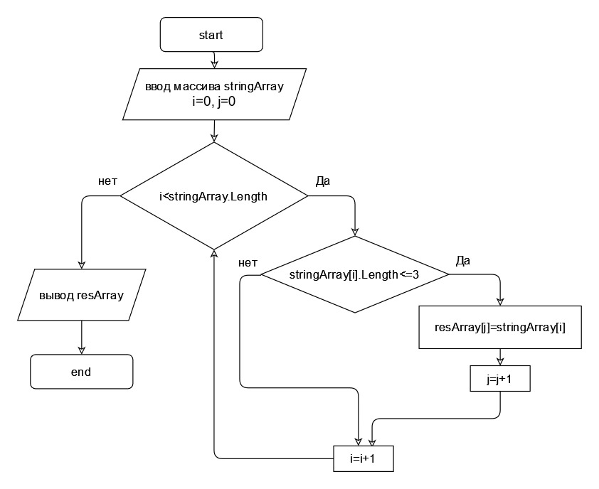

# Итоговая проверочная работа за первый блок обучения
### Задание: написать программу, которая из имеющегося массиа строк, формирует массив из строк длинна которых меньше или равна трем символам.  
   
### Описание алгоритма: 
1. Ввод исходного массива
2. Унициализация переменных
3. В цикле перебираем элемены массива,  если елемент содержит строку менее 3 символов, записываем этот элемен в новвый массив.
4. Выводим результирующий массив на консоль.

## Блок-схема
